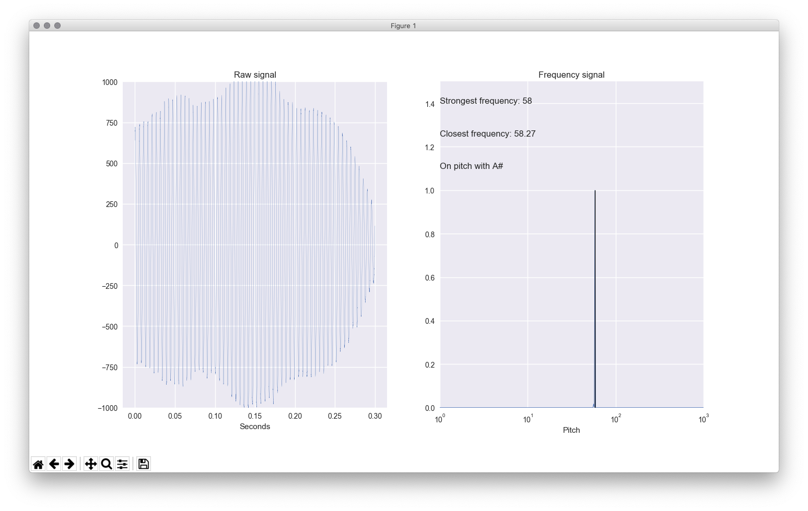

# Tuner

author: Patrick Stetz ([Github](https://github.com/pstetz/))

### Overview

Hook up a microphone and tune your instrument of choice!

### Demo

Below is a demo of the application.  As shown, the tuner will show the raw signal on the left and the frequency signal on the right.  In addition, the dominant pitch is highlighted in black and some helpful messages are shown

